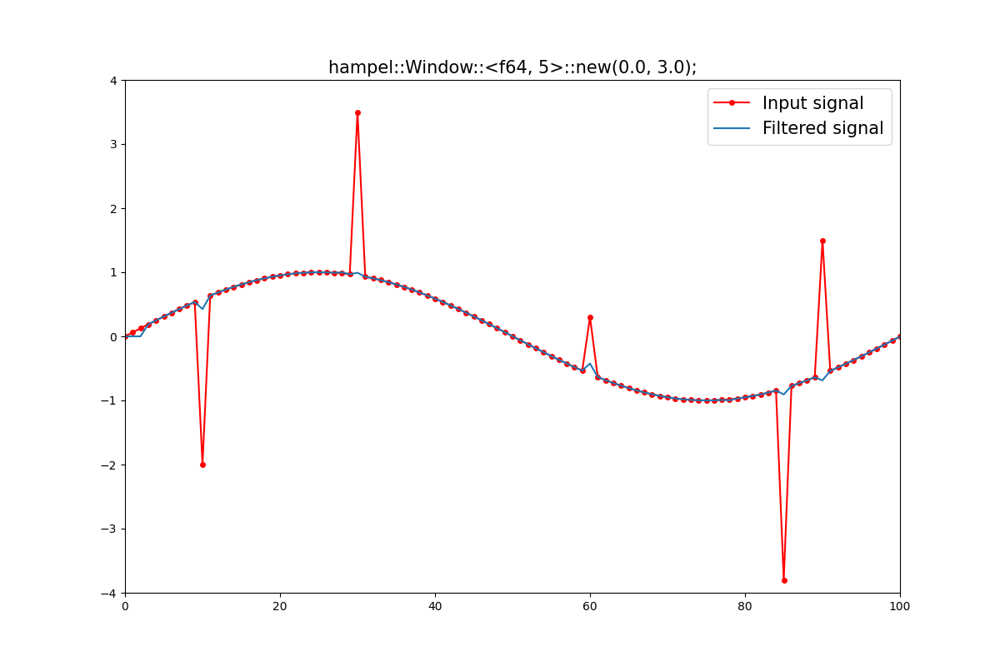

# hampel

Sequential outlier detection and removal using Hampel identifiers.

It supports `f32` and `f64`.

## Usage

Add this to your `Cargo.toml`:

```toml
[dependencies]
hampel = "0.1"
```

## Example

`src/main.rs`:

```rust
use hampel::Window;

fn main() {
    // Window size: 5 (>= 3)
    // Initialization value of window: 0.0
    // Threshold: Median of the window ±3σ.
    let mut filter = Window::<f64, 5>::new(0.0, 3.0);
    
    let input_vals = [0.0; 100];  // <- Containing outliers
    let mut filtered_vals = [0.0; 100];
    for (i, val) in input_vals.iter().enumerate() {
        filtered_vals[i] = filter.update(*val);
    }
    // filtered_vals <-- Outliers have been removed
}
```



## License

Licensed under either of
[Apache License, Version 2.0](https://www.apache.org/licenses/LICENSE-2.0)
or
[MIT License](https://opensource.org/licenses/MIT)
at your option.

### Contribution

Unless you explicitly state otherwise, any contribution intentionally submitted for inclusion in the work by you, as defined in the Apache-2.0 license, shall be dual licensed as above, without any additional terms or conditions.
