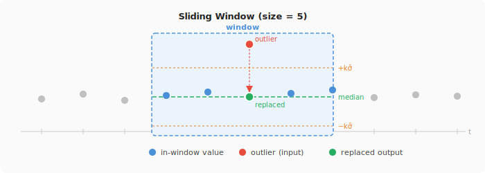
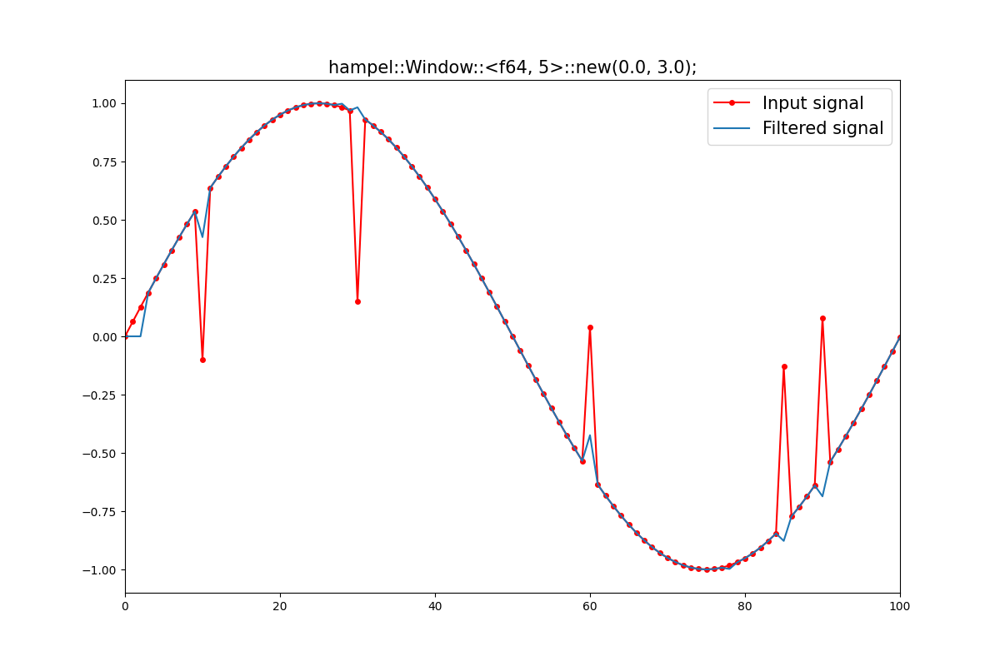
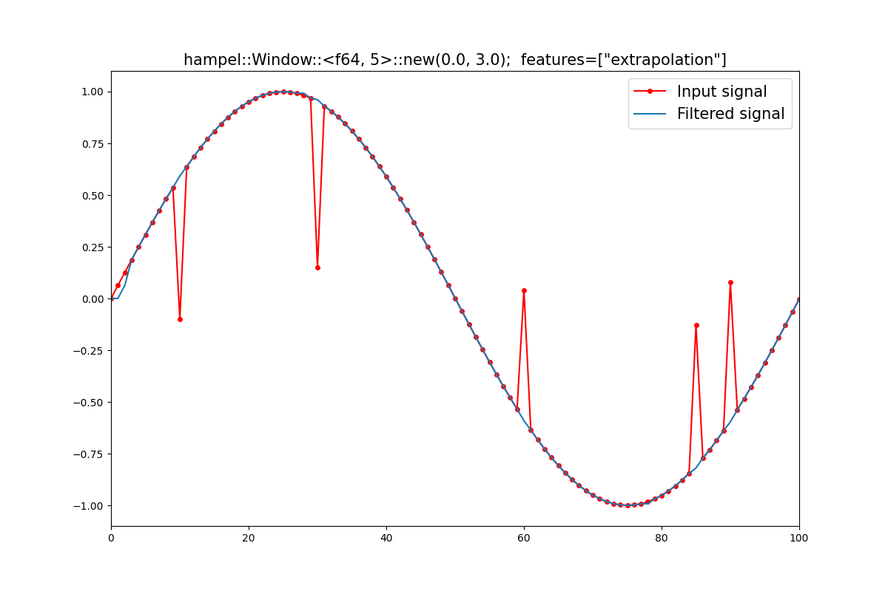

# hampel

Sequential outlier detection and removal using Hampel identifiers.

Supports `f32` and `f64`. Works without `std` — no heap allocation required.

## What is a Hampel Identifier?

A **Hampel identifier** is a robust method for detecting outliers in sequential (streaming) data.
It maintains a sliding window over the most recent `N` values and checks each incoming point
against a threshold derived from the **median** and **MAD** (Median Absolute Deviation) of the window.



The key advantage over mean-based methods is **robustness**: even if the window already contains
a few outliers, the median is unaffected and the estimate stays accurate.

When an outlier is detected, the value is replaced — either with the **window median** (default)
or a **linearly extrapolated** value (see the `extrapolation` feature below).

## Usage

Add this to your `Cargo.toml`:

```toml
[dependencies]
hampel = "0.2"
# features = ["extrapolation"]  # optional — see below
```

### `extrapolation` feature

When this feature is enabled, linear extrapolated values are returned when outliers are detected. When disabled (default), the median value of the window is returned.

## Example

```rust
use hampel::Window;

fn main() {
    // Window size : 5  (must be >= 3)
    // Init value  : 0.0
    // Threshold k : 3.0  →  flag if |x − median| > 3 × σ̂
    let mut filter = Window::<f64, 5>::new(0.0, 3.0);

    let input_vals = [0.0; 100];   // ← replace with your data (may contain outliers)
    let mut filtered_vals = [0.0; 100];

    for (i, val) in input_vals.iter().enumerate() {
        filtered_vals[i] = filter.update(*val);
    }
    // filtered_vals <-- Outliers have been removed
}
```

## Sample output

**Default (median replacement)**



**With `extrapolation` feature**



## License

Licensed under either of
[Apache License, Version 2.0](https://www.apache.org/licenses/LICENSE-2.0)
or
[MIT License](https://opensource.org/licenses/MIT)
at your option.

### Contribution

Unless you explicitly state otherwise, any contribution intentionally submitted for inclusion in the work by you, as defined in the Apache-2.0 license, shall be dual licensed as above, without any additional terms or conditions.
